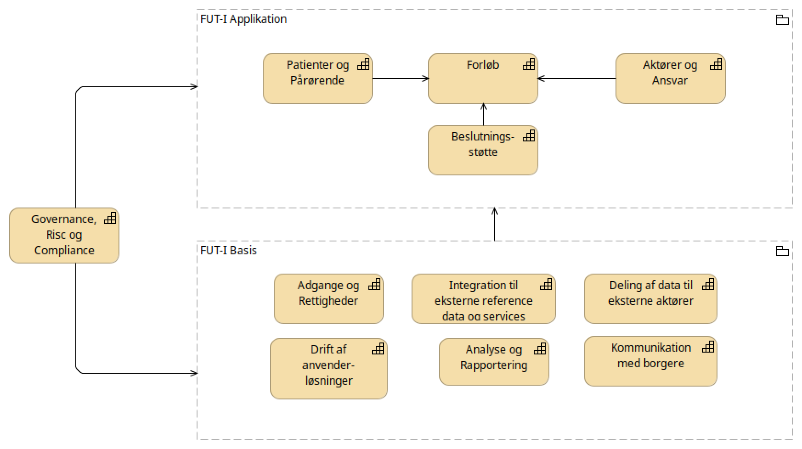
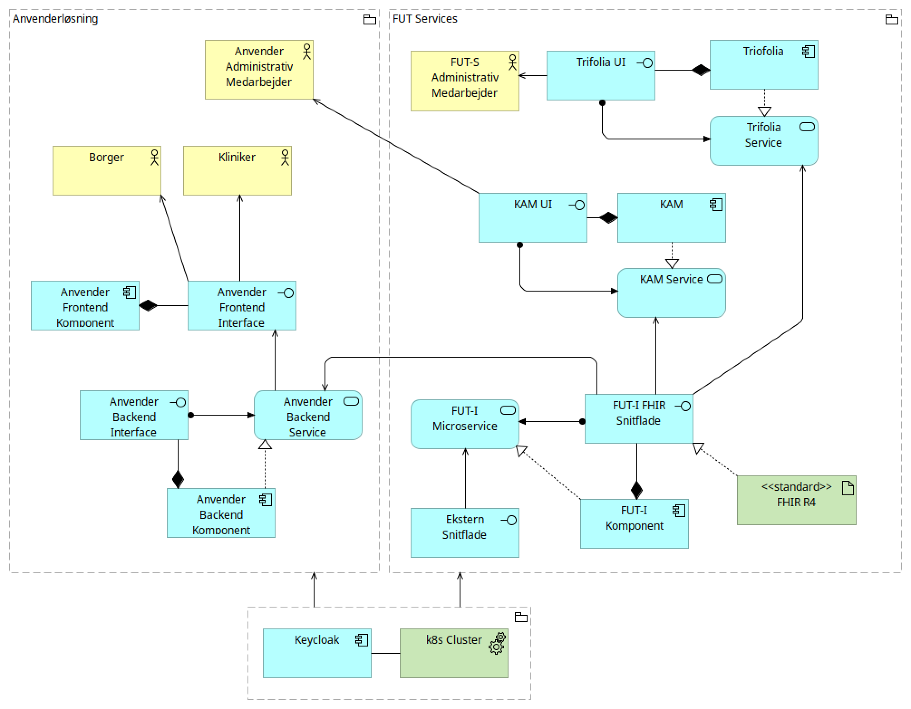
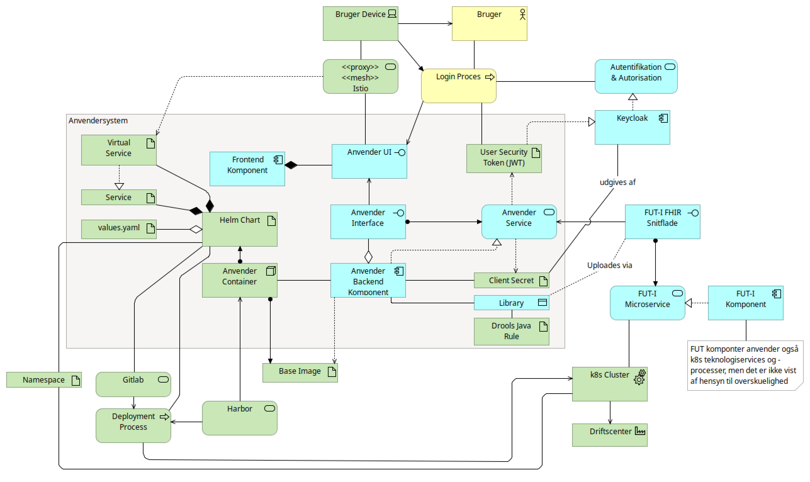
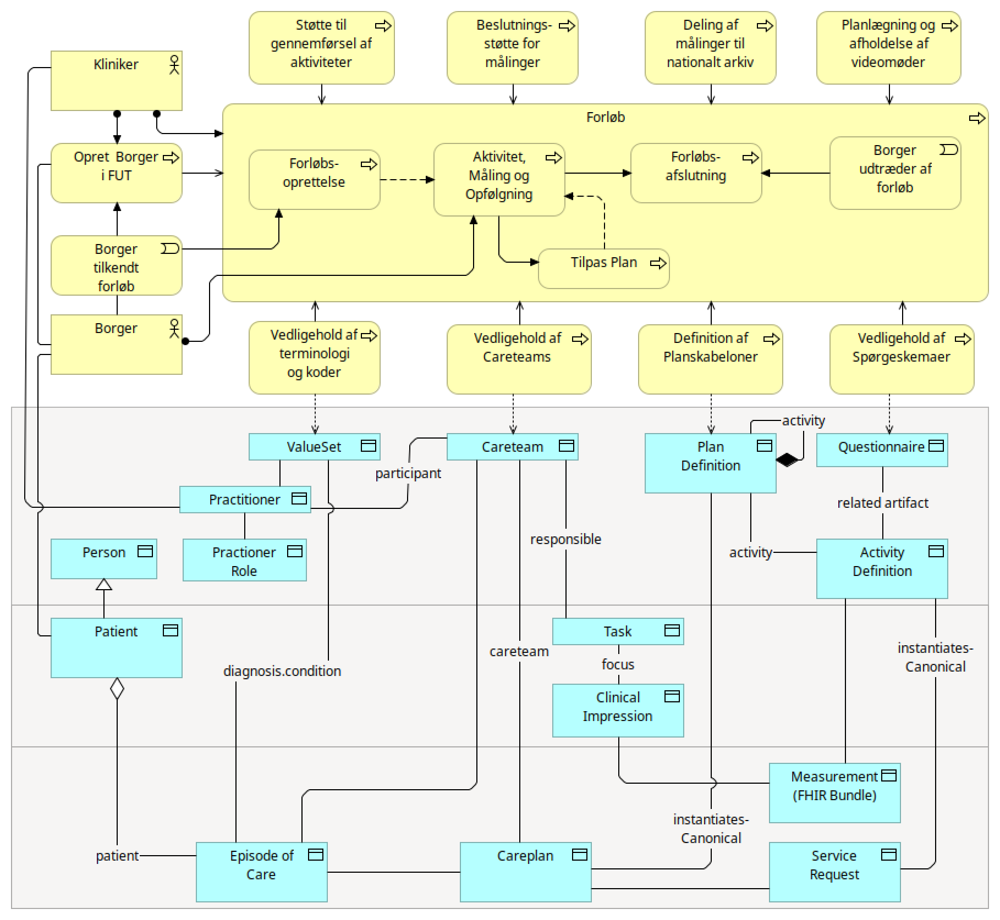
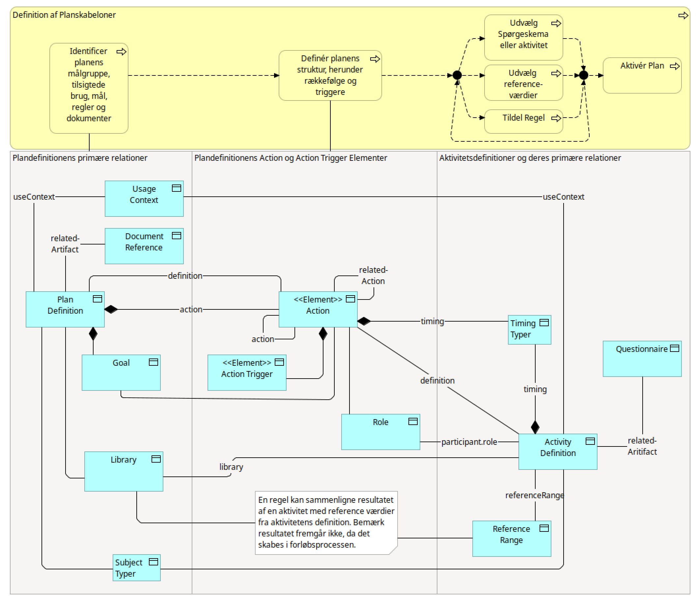
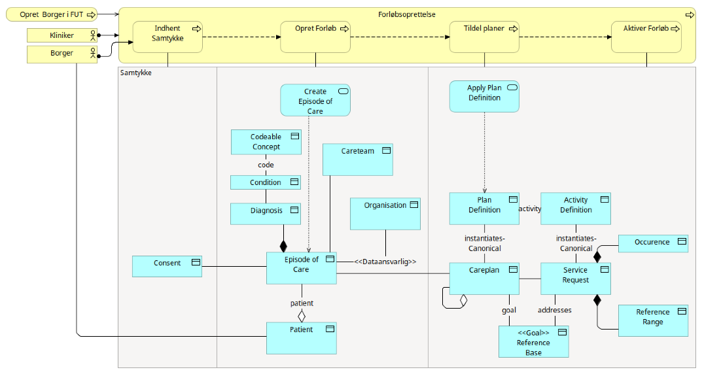
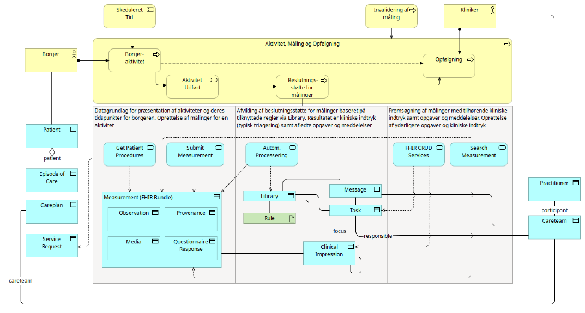
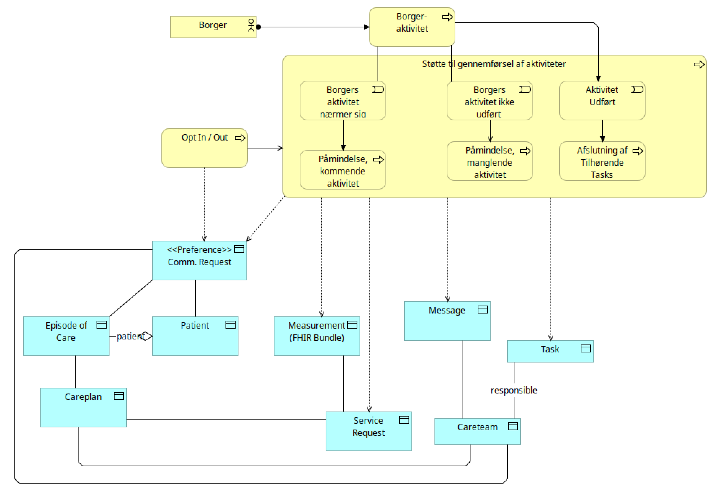

# FUT Infrastruktur

Dette dokument beskriver FUT Infrastrukturen, som indeholder applikations- og teknologiservices til udviklere af telemedicinske løsninger i Danmark. Dokumentet henvender sig til forretningsanalytikere, arkitekter og udviklere, der ønsker en introduktion til, hvad FUT Infrastrukturen indeholder. Den har særligt fokus på, hvordan telemedicinske løsninger (kaldet anvenderløsninger) bygges.

Dokumentet introducerer først de rammer, FUT Infrastrukturen er bygget indenfor, hvorefter den overordnede forretningsarkitektur præsenteres. På baggrund heraf beskrives applikationsarkitekturen for FUT Infrastrukturen og det præciseres hvad en anvenderløsning er, og hvad den skal indeholde. Heraf vil det fremgå, at FUT Infrastrukturen understøtter en række processer (forretningsvendte såvel som tekniske), som anvenderløsninger skal indplacere sig i og tilbyde konkrete, brugervendte løsninger for. Disse processer er centreret omkring borgeres forløb, som består af veldefinerede aktiviteter og opfølgning med henblik på at nå eller vedholde et mål. Det er netop anvenderløsningens ansvar at understøtte brugeroplevelsen for såvel borgere som sundhedspersonale i de processer, der knytter sig til disse forløb. Dokumentet fortsætter ved at beskrive den overordnede brug af den proces- og datamodel, som FUT Infrastrukturen tilbyder anvenderløsninger. I disse beskrivelser angives referencer til mere detaljerede og instruerende beskrivelser.

# Rammesætning

I dette afsnit introduceres formålet med FUT Infrastrukturen samt de principper og politikker forretnings- og applikationsarkitekturen er bygget omkring.

## Formål

FUT Infrastrukturens formål er at understøtte hjemmebehandling med borgeren i centrum på tværs af sektorer, specifikt udmøntet gennem:

* samarbejde om patienten gennem teams, der går på tværs af regioner, kommuner og primærsektoren

* fælles udvikling og vedligehold af funktionalitet, der understøtter anvenderløsninger indenfor monitorering, forebyggelse og behandling

* etablering af best practices for udvikling og drift af nye anvenderløsninger

* sikker adgang baseret på eksplicitte adgange til data (f.eks. borgers egne data eller sundhedspersonales adgang via teams)

* strømlining af mulighederne for at udvinde yderligere værdi af data via ensartet og kvalitetssikret proces- og datamodel

* fælles deployment, drift og overvågning på standardiseret teknologi-infrastruktur (herunder hosting af anvenderløsninger)

## Principper

* For at understøtte formålet følges nedenstående principper:

* Borgeren i Centrum: Borgerens behov er i centrum for alle beslutninger og funktioner

* Sammenhængende Sundhedsforløb: Borgerne oplever et sammenhængende forløb på tværs af sektorer og sundhedsfaglige teams

* Datadrevet Beslutningstagning: Beslutninger skal baseres på data og evidens for at sikre kvalitet og effektivitet i behandlingen

* Sikkerhed og Privatliv: Beskyttelse af borgernes data skal følge gældende lovgivning

* Fleksibilitet og Skalerbarhed: Platformen skal være fleksibel og skalerbar for at kunne tilpasse sig fremtidige behov og teknologiske fremskridt

* Anvendelse af eksisterende Offentlige Data: Anvendelse af nationale og internationale standarder for offentlige data for at sikre konsistens, kvalitet og interoperabilitet. Dette inkluderer referencedata (f.eks. klassifikationer og terminologier), masterdata (f.eks. organisationer) og snitflader (f.eks. medcom)

* Åbenhed og Interoperabilitet: Understøtte gængse teknologier for anvenderløsninger og herved en flerleverandørstrategi for anvenderløsninger

## Politikker

Principperne udmøntes konkret i de nedenstående politikker, som udgør de mest konkrete input til realiseringen af FUT-Infrastrukturen:

* Adgangskontrol og Autorisation: Varetage rollebaseret adgangskontrol for at sikre, at kun autoriserede sundhedsfaglige personer har adgang til relevante data

* Datastyring og Kvalitet: Sikre klare retningslinjer for datastyring, herunder datakvalitet, dataintegritet og databeskyttelse

* Sikkerhedspolitik: Vedligeholde en sikkerhedspolitik, der dækker alle aspekter af platformens drift

* Compliance: Sikre, at platformen overholder alle relevante love og reguleringer, herunder GDPR og sundhedslovgivning

* Brugerinvolvering og Feedback: Aktivt inddrage anvenderløsningerne i udviklingen og forbedringen af platformen gennem regelmæssig feedback og brugerundersøgelser

* Kontinuerlig Forbedring: Implementere en politik for kontinuerlig forbedring, hvor infrastrukturen løbende evalueres og opdateres baseret på brugerfeedback og teknologiske fremskridt

* Standardisering i forhold til Offentlige Data: Infrastrukturen skal de godkendte standarder fra relevante myndigheder. Dette inkluderer datastandarder, snitfladestandarder, terminologier og klassifikationer.

# Begreber

Af nedenstående tabel fremgår de mest anvendte begreber i FUT Infrastrukturen.

| Begreb | Beskrivelse | Forkortelse | Kilde |
| --- | --- | --- | --- |
| FUT Infrastruktur | Den samlede tekniske løsning, der tilbyder services til anvenderløsninger | FUT-I | FUT-S |
| FUT Systemforvaltning |   | FUT-S | FUT-S |
| Anvenderløsning | En borger og/eller klinikerrettet applikation, der bygger på FUT-I |   | FUT-S |
| FHIR | En standard for modellering og anvendelse af sundhedsdata | FHIR |   |
| Kubernetes | En moderne løsning for drift af IT Systemer | K8S, k8s |   |
| Borger | En person, der er bosat i Danmark og kan være i et telemedicinsk forløb |   |   |
| Person | En person fra det centrale personregister |   |   |
| Patient | En person, der omtales i behandlingsmæssig sammenhæng |   |   |
| Måledata | Resultatet af en aktivitet, typisk efter borger har udført den. F.eks. Blodtryk eller en spørgeskemabesvarelse |   |   |
| Bundle | En samling af flere ressourcer i FHIR |   |   |
| Borgertilstand | Kodede tilstande, som udtrykker blandt andet en borgers behov og forudsætninger for omsorg |   | FSIII |
| KAM | En brugergrænseflade, der stilles til rådighed af FUT-I som giver mulighed for at definere planer, aktiviteter, spørgeskemaer og teams bestående af sundhedsperonale |   |   |
| Trifolia | Et system (med en brugergrænseflade) der anvendes til at vedligeholde terminologi, kodesystemer (f.eks. diagnoser) og værdisæt, der "plukker" værdier fra et eller flere kodesystemer |   |   |
| SEB | Sundhedsvæsenets elektroniske brugerstyring, som samler alle sundhedsfaglige brugere på tværs af organisatoriske og sektorielle skel |   |   |

# Forretningsarkitektur

FUT Infrastrukturens formål er omsat til en forretningsarkitektur, der består af kapabiliteter, der hver stiller data, services og processer til rådighed for udviklingen af en anvenderløsning. I nedenstående figur introduceres kapabiliteterne inddelt i tre grupperinger:

De applikationsvendte kapabiliteter, som giver mulighed for at bygge en anvenderløsning på baggrund af adgang til data med en veldefineret model og tilhørerende services.

* Basiskapabiliteter, der sikrer at de mere tekniske aspekter af FUT infrastrukturen kan realiseres. Det drejer sig fortrinsvist om integration til data og services i det øvrige IT-landskab for sundhed, sikkerhed , analyse og rapportering og drift.

* Governance, Risc og Compliance, som er den organisatoriske og dokumentations-baserede støtte til en målrettet, stabil og sikker anvendelse og videreudvikling af FUT Infrastrukturen.

* Konkret anvendes FHIR forretningsobjekter og services til realisering af de tekniske aspekter, mens driftsaspekterne håndteres ved hjælp af containerization i kubernetes.

Tilføj data og proces capability, gør drift, support og devops tydligere (evt eget lag?) og huske også koder og terminologi, tilføj også planer og spørgeskemaer

omdøb til eksterne data og services

I de følgende afsnit introduceres hovedprocesserne for forretningskapabiliteterne kort. Senere i dokumentet gennemgås de vigtigste processer set fra en anvenderløsnings perspektiv.

## Patienter og Pårørende

Denne kapabilitet stiller de grundlæggende services til rådighed, som gør det muligt at vedligeholde borgernes stamdata og sikre, at informationen altid er korrekt på tværs af systemlandskabet. Forretningsarkitekter kan planlægge processer med sikkerhed for, at relevante oplysninger hentes automatisk gennem integrationer til eksterne data- og services, herunder import af CPR-data.

Kapabiliteten understøtter desuden modellering af relationer til pårørende samt delegering af fuldmagter, så det er tydeligt, hvem der må agere på borgerens vegne. Endelig kan anvenderløsninger sende målrettede beskeder til borgerne via NemSMS, hvilket giver en robust kommunikationskanal til påmindelser og øvrig dialog.

## Aktører og Ansvar

Kapabiliteten giver et konsolideret billede af de organisationer, roller og ansvar, som indgår i et tværsektorielt behandlingsforløb. Via integrationer til kilder som SOR, Fælleskommunale Organisationssystem og Yderregisteret holdes data opdateret uden manuelle processer, hvilket gør det nemt for forretningsarkitekter at beskrive, hvem der leverer hvilke ydelser.

Det bliver samtidig muligt at definere og vedligeholde careteams på tværs af regioner, kommuner og praksissektor. Dermed kan ansvarsfordelingen tydeligt indarbejdes i modeller og processer, så borgeren oplever et koordineret forløb.

## Beslutningsstøtte

Kapabiliteten stiller et fælles lag til rådighed for at beskrive og eksekvere beslutningslogik, eksempelvis triagering af borgere. Forretningslogikken bindes tæt til borgernes data, så hver beslutning bygger på opdaterede målinger og aktiviteter, og resultatet registreres som FHIR-ressourcer, der kan deles og genbruges på tværs af løsninger.

## Planer, Aktiviteter og Spørgeskemaer

Kapabiliteten gør det muligt at opstille plandefinitioner, der detaljeret beskriver, hvordan omsorg og behandling udføres for en specifik diagnose. Forretningsarkitekter kan dermed modellere aktiviteter, afhængigheder og støttefunktioner, herunder hvordan beslutningsstøtten skal inddrages.

Tilknyttede aktivitetsdefinitioner og spørgeskemaer kan genbruges på tværs af planer, og der kan beskrives relevante grænseværdier, såsom acceptable pulsintervaller. Det skaber et biblioteks-lignende fundament, hvor standardiserede elementer kan kombineres og tilpasses til den enkelte borger.

## Koder og terminologi

Kapabiliteten sikrer en fælles struktur for kodesæt og terminologier ved at automatisere importen af eksempelvis diagnoser og borgernes tilstande fra eksterne kilder. Forretningsarkitekter kan derfor bygge processer på et konsistent begrebsapparat, som vedligeholdes ét sted.

På den måde bliver det enkelt at definere værdisæt og andre afledte klassifikationer, der kan bruges i både brugerflader og beslutningslogik uden at miste sammenhængen til de officielle standarder.

## Forløb

Kapabiliteten samler arbejdet med telemedicinske forløb, så nye forløb kan oprettes, vedligeholdes og afsluttes med en klar reference til de tilhørende planer. Forretningsarkitekter kan tilpasse planerne til den enkelte borger, samtidig med at standardelementer genbruges for at sikre kvalitet og ensartethed.

Når forløbene afvikles, understøttes borgernes aktiviteter af automatiske påmindelser og kommunikation via de dedikerede services, og beslutningsstøtten kan skabe opfølgningsopgaver til careteams. Det giver et sammenhængende flow fra planlægning til udførelse og opfølgning.

## Adgange og rettigheder

Kapabiliteten stiller en samlet hybrid brugerbase til rådighed, hvor borgere og pårørende logger ind via MitID, mens sundhedspersonale anvender SEB. Forretningsarkitekter kan dermed planlægge løsninger, der tilgodeser både borgerrettede flows og faglige arbejdsgange uden at gå på kompromis med sikkerheden.

Roller, dataafgrænsninger og øvrige adgangsregler administreres centralt, og adgangen for eksterne systemer kan håndteres via lokale brugeropslag. Samtidig sikrer auditlogning fuld sporbarhed, så compliance- og sikkerhedskrav dokumenteres.

## Integration til eksterne services

Kapabiliteten koordinerer de eksterne integrationer gennem NSP og giver en struktureret ramme for at tilslutte nye services. De øvrige processer kan derfor forudsætte, at nødvendige data og funktioner er tilgængelige på en sikker og standardiseret måde.

## Deling af data med eksterne aktører

Kapabiliteten gør det muligt at dele forløbsdata med autoriserede eksterne aktører, eksempelvis KIH. Forretningsarkitekter kan forme processer, hvor data distribueres på tværs af organisationer, samtidig med at regler for adgang og sporbarhed respekteres.

## Kommunikation med borgere

Kapabiliteten leverer de kanaler, der bruges i andre processer til beskeder, påmindelser og dialog med borgerne. Den kan dermed indgå som et genanvendeligt element, når forretningsarkitekter planlægger borgerrettede kontaktpunkter.

## Analyse og Rapportering (under udvikling)

Kapabiliteten, som er under udvikling, fokuserer på at give indsigt i anvendelsen af FUT Infrastrukturen. Den omfatter både dashboards, der giver et aktuelt overblik, og API-adgang til data med mulighed for at maskere og begrænse information, så den kan deles sikkert udenfor data platformen.

## Drift af infrastrukturen og anvenderløsninger, der understøttes af tværgående

Kapabiliteten skaber de driftsprocedurer og tekniske mekanismer, der holder både infrastrukturen og anvenderløsningerne i gang. DevOps-processer og pipelines understøtter kontinuerlige releases, mens containerisation sikrer, at løsninger kan skaleres og isoleres efter behov.

Service mesh, observability og monitorering gør det muligt at følge trafikken, reagere hurtigt på hændelser og dokumentere stabil drift, så forretningsarkitekter trygt kan planlægge løsninger med høje oppetidskrav.

## Governance, Risc og Compliance

Kapabiliteten sætter rammerne for, hvordan FUT Infrastrukturen videreudvikles og tilpasses, så nye behov kan imødekommes uden at kompromittere kvalitet eller sikkerhed. Governanceprocesserne følger op på drift, kontrakter og anvendelsen af data, hvilket giver den nødvendige dokumentation i forhold til lovgivning og interne politikker.

# Applikationsarkitektur

I dette afsnit gennemgås det, hvordan forretningsarkitekturen er realiseret i en applikationsarkitektur. Først fokuseres der på, hvordan FUT-Infrastrukturen understøtter anvenderløsninger i at lave en brugervendt applikation og hvordan anvenderløsningen overordnet skal opbygges. Derefter øges detaljeringsgraden i forhold til, hvordan anvenderløsningen teknisk skal opbygges.

## FUT-Infrastrukturen

I dette afsnit introduceres det kort, hvordan forretningsarkitekturen er realiseret. Som det ses af nedenstående illustration er ansvaret for applikationen delt mellem anvenderløsningen og FUT Services. Anvenderløsningens ansvar er at lave en borger- og klinikervendt service i form af backend service med et tilhørende interface. Anvenderløsningen bruger FUT-Infrastrukturen services og leveres som en komponent, der driftes i samme miljø som infrastrukturen, konkret via Kubernetes. Desuden kan anvenderløsningen indeholde en frontend, som udstiller services til borgere og sundhedspersonale. Deployment varetages af tværgående DevOps processer og værktøjer, mens  Sikkerheden varetages af Keycloak.

... tilføj devops pipeline...

I de følgende afsnit introduceres services i infrastrukturen kort med henblik på at give overblik i forhold til anvenderløsninger. Der gives endvidere eksterne referencer til yderligere dokumentation.

### Brugervendte Services

KAM, som tilbyder vedligehold af careteams samt planerdefinitioner, aktiviteter og spørgeskemaer

Trifolia, som tilbyder vedligehold af terminologi, kodesystemer og værdisæt

### FUT-I Microservices

Lagets mikrotjenester realiserer de forretningskapabiliteter, som anvenderløsninger har behov for, og eksponerer dem gennem standardiserede FHIR-profiler. Arkitekter kan designe integrationer omkring REST/JSON-endpoints, der håndterer både læsning og registrering af kliniske data uden behov for proprietære adaptere.

Tjenesterne understøtter parametriserede søgninger, filtrering, paging og conditional updates, hvilket gør det muligt at modellere avancerede dataflows samtidig med, at oprindelig kontekst bevares. Det giver et forudsigeligt og skalerbart fundament for applikationslogik på tværs af leverandører.

### Driftsservices

Driftslaget ligger på Kubernetes og omfatter både FUT-Infrastrukturen og de tilknyttede anvenderløsninger. Arkitekter kan dermed planlægge deploymentstrategier på et fælles cluster, hvor container orchestration, autoskalering og rolling updates håndteres gennem standardiserede værktøjer.

Monitoring og fejlhåndtering er integreret i platformen, så driftsopgaver kan automatiseres og observabilitet sikres fra første dag. Det forkorter time-to-market og reducerer behovet for at etablere parallelle driftsmiljøer.

### Platformservices

Service mesh-laget bygger på Istio og sikrer, at kald mellem mikrotjenester rutes korrekt, beskyttes og overvåges. Applikations- og teknologiarkitekter kan udnytte den indbyggede politikstyring til at gennemtvinge kryptering, rate limiting og adgangsbegrænsninger uden at ændre i selve tjenesterne. Observabilitet leveres gennem fælles telemetri, hvilket gør det lettere at diagnosticere performanceproblemer på tværs af miljøer.

Identitet og adgang styres af Keycloak, der fungerer som IdP med OIDC og understøtter federation via SAML samt MitID-integration til borgere. Keycloak udsteder JWT-tokens, som anvendes mod API’erne, og validerer scopes og teamtilknytninger ved hvert kald. All aktivitet registreres i audit- og event-logs, så sikkerhedshændelser kan spores og dokumenteres.

### DevOps Services

DevOps-kæden er centreret omkring GitLab CI/CD, som automatiserer build, test og deployment. Artefakter gemmes i Harbor, så images kan signeres og versionsstyres, inden de rulles ud i Kubernetes.

Helm orkestrerer installationerne og gør det muligt at parameterisere miljøer på tværs af regioner og leverandører. Arkitekter kan derfor beskrive ønsket tilstand én gang og lade pipeline håndtere udrulningen helt frem til produktion.

## Anvenderløsninger

En anvenderløsninger er en containeriserede webklient med tilhørende backend-komponenter, der interagerer med en mikroservice-baseret FHIR-platform hostet på Kubernetes (k8s). Den understøtter autentificering via Keycloak og adgang til FHIR-data gennem sikrede API-kald. Den deployes som en Helm-baseret applikation og integreres i platformens tekniske services som Istio og CI/CD pipelines.

I de følgende afsnit beskrives kravene til anvenderløsningens forskellige dele.

### Frontend

Frontendlaget udstiller den webbaserede brugeroplevelse og orkestrerer interaktioner med platformens services. Applikationsarkitekter kan modellere komponenter, der håndterer sessioner gennem JWT’er og sikrer, at brugerens kontekst bevares på tværs af sidelæsninger. OIDC-flowet mod Keycloak integreres direkte i brugerinterfacets routing, så login, tokenfornyelse og logout håndteres uden separate klienter.

### Backendkomponent

Backendkomponenten kører som en containeriseret service og udstiller et API, der operationaliserer forretningslogikken. Arkitekter beskriver her, hvordan JWT’er valideres, scopes kontrolleres, og brugerens kontekst omsættes til målrettede FHIR-kald. Laget håndterer regler (fx Drools), caching og integration til øvrige mikrotjenester, så applikationen kan reagere på både synkrone og asynkrone hændelser.

### Containerization, Infrastructure-as-Code og Deployment

Arkitekturen beskrives som kode gennem Helm charts, hvor miljøspecifikke værdier (values.yaml) styrer konfigurationen. Images publiceres i Harbor og rulles ud via GitLab CI/CD, der automatiserer build, test og release. Kubernetes-artefakter, herunder Service og VirtualService, versioneres sammen med løsningen, så netværkstopologi, trafikregler og afhængigheder kan testes og promoveres entydigt mellem miljøerne.

Detaljeret information om kravene til at bygge en anvenderløsning findes [her](https://ehealth-dk.atlassian.net/wiki/spaces/EDTW/pages/76316673/Developing+on+the+eHealth+Platform). 

# Processer

I dette afsnit introduceres de processer, der er mest relevante for processer for anvenderløsninger. Da det overordnede ansvar for en anvenderløsning er at understøtte telemedicinske forløb tager præsentationen udgangspunkt i denne. Derefter gennemgås de vigtigste detaljer omkring definition af planer aktiviteter, da de er en væsentlig forudsætning for oprettelse af et forløb. Endelig præsenteres de konkrete underprocesser, som udgør kernen i omsorgen for borgeren. I beskrivelsen af processerne er vægten lagt på aktører, events og flow samt hvordan FUT-Infrastrukturens services understøtter dette i form af FHIR ressourcer og operations.

## Forløb

Forløbsprocessen er den centrale proces, en anvenderløsning skal understøtte. Den er illustreret i nedenstående figur, hvor selve processen er repræsenteret ved den gule kasse Forløb, som indeholder de underprocesser, anvenderløsningen er ansvarlig for. I figuren fremgår også et antal processer, som FUT Infrastrukturen tilbyder anvenderløsninger for at understøtte forløbet. Disse beskrives senere i dette afsnit.

 
Det er forløbet, der beskriver hvilken diagnose, borgeren modtager omsorg for, samt hvilke parter der er involveret. Omsorg dækker bredt over monitorering, behandling, undervisning og hjælp til selvhjælp. Parterne består dels af de sundhedsfaglige personer, der er involveret i det konkrete forløb samt de organisatoriske enheder, der har ansvaret for dem. Den konkrete omsorg er repræsenteret af en plan, der beskriver de aktiviteter, der skal udføres for eller af borgeren.

Eksempler:

En borger er i forløb for forhøjet blodtryk (diagnose) og såvel egen læge som kommunale sundhedsfaglige medarbejdere (parter) er involveret i monitorering gennem ugentlige målinger af borgerens blodtryk (plan)

En borger er i forløb med henblik på rygestop ("diagnose") og interagerer dagligt med en hjælp-til-selvhjælp løsning (plan) med mulighed for sparring hos et kommunalt sundhedscenter (part)

En borger er i forløb med henblik på overvågning af hjertelidelse (diagnose) og rapporterer dagligt puls og andre data på baggrund af udførte aktiviteter (plan). Såvel læge på sygehus samt kommunale sundhedsfaglige medarbejdere indgår i monitoreringen af borgerens tilstand (parter).

Et forløb opstår når en borger bliver tilkendt det på baggrund af en klinisk vurdering og samtale med borgeren. Efter oprettelsen af forløbet er oprettet overgår det til underprocessen Aktivitet, Måling og Opfølgning, som er de centrale begreber i den plan, der beskriver omsorgen. I forbindelse med opfølgningen kan der vise sig behov for at tilpasse planen. Forløbet kan afsluttes ved at borgeren eksplicit udtræder (herunder at borgeren afgår ved døden) eller på baggrund af opfølgningen.

Under de gule proces-elementer i figuren er det angivet, hvilke centrale FHIR ressourcer, der repræsenterer de forskellige entiteter i FUT Infrastrukturen. Som det ses er disse ressourcer opdelt i tre lag:

Det øverste lag er FHIR ressourcer, hvor det primære ansvar for vedligehold (livscyklus) ejes af FUT Infrastrukturen gennem støtteprocesser - enten via en brugergrænseflade eller baseret på hændelser

Det nederste lag er FHIR ressourcer, hvor det primære ansvar for vedligehold (livscyklus) ejes af anvenderløsninger - gennem kald af services i FUT Infrastrukturen

Det mellemste lag er FHIR ressourcer, hvor ejerskabet for vedligehold (livscyklus) er delt mellem FUT Infrastrukturen og anvenderløsningen.

Det ses således, at det er anvenderløsningen, der har ansvar for at oprette forløbet, kaldet Episode of Care i FHIR. Tilsvarende har den ansvar for at vedligeholde Careplan, som repræsenterer den enkelte borgers plan specialiseret fra den overordnede skabelon (Plan Definition), som vedligeholdes af infrastrukturen gennem brugergrænsefladen i KAM. Borgerens plan indeholder et antal Service Requests, der modsvarer de aktiviteter, der indgår i skabelonen og giver mulighed for tilpasning.

Senere i dette dokument gennemgås det, hvordan FUT Infrastrukturen understøtter anvenderløsningen i at realisere forløbsprocessen i kraft af services til data og funktionalitet i forbindelse med de omtalte FHIR ressourcer. Inden da introduceres de støtteprocesser, der er vist omkring  for at give en introduktion til de FHIR ressourcer, der stiller information om borgere, teams, organisation, planer mm. til rådighed for anvenderløsningen.

De processer, der er placeret udenfor forløbsprocessen i figuren tilbydes af FUT infrastrukturen til understøttelse af forløbsprocessen. En anvenderløsning kan (og i nogle tilfælde skal) således anvende disse. Nogle af støtteprocesserne kan afvikles via brugergrænseflader, der stilles til rådighed af FUT Infrastrukturen. Andre er kun tilgængelige via FHIR services eller afvikles på baggrund af hændelser. Støtteprocesserne beskrives i nedenstående tabel.

| Proces | Formål | Anvendelse | FHIRressourcer |
| --- | --- | --- | --- |
| Vedligehold af terminologi og koder | Sikre ensartede, veldefinererede og versionerede begreber og koder, herunder diagnoser | Vedligehold varetages gennem service requests til FUT-S, der anvender brugergrænsefladen i Trifolia. Se [brugervejledning](https://docs.ehealth.sundhed.dk/latest-released/trifolia/usermanual/index.html).| ValueSet CodeSystem |
| Vedligehold af Careteams | Sikre at sundhedsfaglige medarbejdere kan arbejde sammen på tværs af organisatoriske grænser | Oprettelse og vedligehold af teams som kan indeholde medarbejdere fra såvel regioner, kommuner samt ydersektoren. Varetages af administrative medarbejdere gennem KAM. Se [brugervejledning](https://fut-portal.rm.dk/spaces/FSD/pages/23101475/Oprettelse+af+Care+teams) | CareTeam |
| Vedligehold af Plandefinitioner | Sikre effektivitet, kvalitet og ensartethed i definition af skabeloner for planer, som definerer borgerens aktiviteter på tværs af anvenderløsninger | Varetages af sundhedsmedarbejdere tilknyttet en anvenderløsning gennem KAM. Se [brugervejledning](https://fut-portal.rm.dk/spaces/FSD/pages/23101650/Oprettelse+af+planer).    | PlanDefinition, ActivityDefinition |
| Vedligehold af Spørgeskemaer | Sikre effektivitet, kvalitet og ensartethed i definition af spørgeskemaer for planer, som definerer borgerens aktiviteter på tværs af anvenderløsninger | Varetages af sundhedsmedarbejdere tilknyttet en anvenderløsning gennem KAM. Se [brugervejledning](https://fut-portal.rm.dk/spaces/FSD/pages/23101506/Oprettelse+af+sp%C3%B8rgeskema). | Questionnaire |
| Støtte til gennemførsel af aktiviteter | Sikre effektivitet, kvalitet og ensartethed i gennemførsel af de aktiviteter, der indgår i borgerens planer på tværs af anvenderløsninger | Varetages af infrastrukturen på baggrund af præferencer for kommunikation for sundhedspersonale og borgere sat af anvender.  | Communication CommunicationRequest Task. [Dokumentation](https://ehealth-dk.atlassian.net/wiki/spaces/EDTW/pages/2415034369/Controlling+Creation+of+Messages).|
| Beslutningsstøtte for målinger | Støtte automatisering, kvalitet og ensartethed i kliniske vurderinger (herunder triagering) på baggrund af målinger fra de aktiviteter, der indgår i borgerens aktiviteter. | Definition af regler varetages af anvenderløsningen i form af udvikling af regler, der opbevares i FHIR Library. Afvikling varetages af FUT-Infrastrukturen , som på baggrund af borgerens aktiviteter og måledata producerer kliniske indtryk og opgaver, som anvenderløsningen præsenterer for de tilknyttede careteams.  | FHIR Library ServiceRequest Measurement ClinicalImpression Task. [Dokumentation](https://ehealth-dk.atlassian.net/wiki/spaces/EDTW/pages/2550661140/Automated+Processing#AutomatedProcessing-AutomatedProcessingofSubmittedMeasurement)   |
| Deling af målinger til nationalt arkiv | Dele | Varetages af FUT Infrastrukturen på baggrund af FHIR data skabt og vedligeholdt af anvenderløsninger. | [Dokumentation](https://ehealth-dk.atlassian.net/wiki/spaces/EDTW/pages/2698903576/Sharing+through+Registering+Documents+in+National+Document+Sharing+Infrastructure)   |
| Planlægning og afholdelse af videomøder | Sikre effektiv kommunikation mellem borger og sundhedspersonale | Varetages af anvenderløsning gennem FUT Microservice | Appointment [Dokumentation](https://ehealth-dk.atlassian.net/wiki/spaces/EDTW/pages/663945265/Video+endpoint+federation+VDX) |
| Vedligehold persondata i FUT | Sikre korrekte og opdaterede grunddata om borgere | Stamdata importeres af FUT-I i form af cpr-data | Person Patient RelatedPerson [Dokumentation](https://ehealth-dk.atlassian.net/wiki/spaces/EDTW/pages/3553820678/Synchronization+of+National+patient+data) |

## Opret Plandefinition

Borgerens planer tager udgangspunkt i tilpasning af en planskabelon. Skabelonerne har til formål at sikre kvaliteten i de planer, borgerne konkret tildeles. I Skabelonerne angives derfor mål og rammer for brugen af planen, såvel som instrukser for, hvilke aktiviteter, der skal udføres. En aktivitet er således karakteriseret ved hvad der skal udføres, hvornår den skal udføres og hvordan det relaterer til de mål og rammer, der er indeholdt i planen.

Selvom processen med at definere planskabeloner er understøttet af brugergrænsefladen i KAM er det alligevel værd at gennemgå hvordan opbygning sker for at understøtte forståelsen af, hvordan planskabelonerne senere bruges. Det skal bemærkes, at den proces, der illustreres herunder er logisk opbygget med henblik på at forstå FHIR ressourcerne og ikke følger det brugervendte flow i KAM. Underprocesserne i definitionen af en planskabelon beskriver i det følgende afsnit.

I nedenstående tabel beskrives formål, anvendelse og de involverede FHIR ressourcer for oprettelse af plandefinitioner, herunder aktivitetsdefinitioner og spørgeskemaer.

| Underproces | Formål | Anvendelse | Involverede FHIR Ressourcer |
| --- | --- | --- | --- |
| Definer mål og rammer | Fastlægge hvem og hvad planen skal adressere og hvilke artifakter, der skal anvendes i den | Varetages af sundhedsmedarbejder tilknyttet en anvenderløsning gennem KAM og danner derefter grundlag for tilrettede planer (CarePlan) for borgere.| En [PlanDefinition](https://build.fhir.org/ig/fut-infrastructure/implementation-guide/StructureDefinition-ehealth-plandefinition.html) referer en [UsageContext](https://hl7.org/fhir/R4/metadatatypes.html#UsageContext), som beskriver hvilke anvenderløsninger, planen er tiltænkt. Gennem elementet [addresses](https://build.fhir.org/ig/fut-infrastructure/implementation-guide/StructureDefinition-ehealth-plandefinition-definitions.html#PlanDefinition.goal.addresses) fremgår hvilke [Condition](https://hl7.org/fhir/R4/valueset-condition-code.html)s planen er tiltænkt. Via reference til [Library](https://build.fhir.org/ig/fut-infrastructure/implementation-guide/StructureDefinition-ehealth-library.html) er det angivet hvilke beslutningsstøtte-biblioteker, der kan anvendes for resultatet af aktiviteterne. Endelig angiver [DocumentReference](https://build.fhir.org/ig/fut-infrastructure/implementation-guide/StructureDefinition-ehealth-documentreference.html) dokumenter, der kan understøtte gennemførsel af planen. |
| Definer struktur og afvikling | Fastlægge den overordnede struktur for aktiviteter i plandefintionen, herunder rækkefølge for triggere. | Varetages af sundhedsmedarbejder tilknyttet en anvenderløsning gennem KAM | I plandefinitionens [action](https://build.fhir.org/ig/fut-infrastructure/implementation-guide/StructureDefinition-ehealth-plandefinition-definitions.html#PlanDefinition.action) element refereres de aktitivitieter i form af [ActivityDefinition](https://build.fhir.org/ig/fut-infrastructure/implementation-guide/StructureDefinition-ehealth-activitydefinition.html)s eller andre plandefinitioner (underplaner), som indgår i planen. På actvity elementet kan der også angives [ActionTrigger](https://build.fhir.org/ig/fut-infrastructure/implementation-guide/StructureDefinition-ehealth-actionTrigger.html)s, som specificerer rækkefølge og blandt andet sikrer, at beslutningsstøtte foretages efter måleresultater er afsendt. |
| Specificer aktiviteter | Udspecificere hvornår og hvordan aktiviteter skal udføres | Varetages af sundhedsmedarbejder tilknyttet en anvenderløsning gennem KAM | De konkrete aktiviteter er beskrevet via [ActivityDefinition](https://build.fhir.org/ig/fut-infrastructure/implementation-guide/StructureDefinition-ehealth-activitydefinition.html). Aktiviteten kan bestå i at skulle måle noget (producere en [Observation]()), gennemføre et spørgeskema, [Questionnaire](https://hl7.org/fhir/R4/questionnaire.html) (producere et [QuestionnaireResponse]()) eller at tage et foto (producere et [Media]()). Der kan også angives grænseværdier gennem [ReferenceRange](), der benyttes i beslutningsstøtte til at afgøre, om der skal oprettes en opgave eller kommunikation til sundhedspersonalet på baggrund af de producererede  måleresultater. Hvornår og hvor ofte aktiviteten skal udføres angives gennem elementet [timing](https://build.fhir.org/ig/fut-infrastructure/implementation-guide/StructureDefinition-ehealth-activitydefinition-definitions.html#ActivityDefinition.timing[x])  |
| Aktivér plan | Publicere planen til brug | Varetages af sundhedsmedarbejder tilknyttet en anvenderløsning gennem KAM |   |

Plandefinitioner kan udlæses fra et miljø og indlæses på andre, hvorved anvenderløsninger undgår at skulle oprette samme plan flere gange - med fare for inkonsistens. Derudover et det muligt at lave nye versioner af en plandefinition. Både udlæsning/indlæsning og oprettelse af nye versioner er beskrevet her: [PlanDefinition](https://build.fhir.org/ig/fut-infrastructure/implementation-guide/StructureDefinition-ehealth-plandefinition.html)

## Forløbsoprettelse

Oprettelse af et telemedicinsk forløb foretages af en sundhedsmedarbejder (kliniker) og består i at indhente samtykke fra borgeren, skabe selve forløbet med diagnose, som er et element, der udpeger en såkaldt Condition, som er et valueset, der består af diagnosekoder og borgertilstande. Derefter tilpasses og tildeles en eller flere planer til forløbet. Endelig aktiveres forløbet så omsorgen for borgeren kan begynde.

Oprettelse af forløb med tilknytning af plan

Underprocesserne i oprettelsen af et forløb beskrives i den følgende tabel.

| Proces | Formål | Anvendelse | Involverede FHIR Ressourcer |
| --- | --- | --- | --- |
| Indhent Samtykke | Sikre borgerens samtykke til forløbet | Indhentes af sundhedspersonale og dokumenteres gennem anvenderløsningen ved oprettelse af forløbet. | [Consent](https://build.fhir.org/ig/fut-infrastructure/implementation-guide/StructureDefinition-ehealth-consent.html) |
| Opret Forløb | Oprette et forløb for en borger med kendt diagnose og ansvar i inaktiv tilstand | Foretages af sundhedspersonale gennem anvenderløsningen. | Anvenderløsningen opretter en [EpisodeOfCare](https://build.fhir.org/ig/fut-infrastructure/implementation-guide/StructureDefinition-ehealth-episodeofcare.html) gennem operationen [Create an EpisodeOfCare](https://build.fhir.org/ig/fut-infrastructure/implementation-guide/OperationDefinition--s-create-episode-of-care.html). Der angives reference til [Patient](https://build.fhir.org/ig/fut-infrastructure/implementation-guide/StructureDefinition-ehealth-patient.html), [Condition](https://build.fhir.org/ig/fut-infrastructure/implementation-guide/StructureDefinition-ehealth-condition.html), [Consent](https://build.fhir.org/ig/fut-infrastructure/implementation-guide/StructureDefinition-ehealth-consent.html), [Careteam](https://build.fhir.org/ig/fut-infrastructure/implementation-guide/StructureDefinition-ehealth-careteam.html) og [Organization](https://build.fhir.org/ig/fut-infrastructure/implementation-guide/StructureDefinition-ehealth-organization.html).  |
| Tildel Planer | Oprette borgervendte planer med aktiviteter for forløbet | Foretages af sundhedspersonale gennem anvenderløsningen. | Anvenderløsningen kalder [Create a careplan](https://build.fhir.org/ig/fut-infrastructure/implementation-guide/OperationDefinition--s-apply.html) som giver skaber en [CarePlan](https://build.fhir.org/ig/fut-infrastructure/implementation-guide/StructureDefinition-ehealth-careplan.html) med tilhørende [ServiceRequests](https://build.fhir.org/ig/fut-infrastructure/implementation-guide/StructureDefinition-ehealth-servicerequest.html) ud fra en plandefinition. Hver servicerequest referer en activitydefinition og beskriver hvilke aktiviteter, borgeren eller sundhedsmedarbejderen skal udføre. [ReferenceRange](https://build.fhir.org/ig/fut-infrastructure/implementation-guide/StructureDefinition-ehealth-referenceRange.html) anvendes til at udtrykke grænseværdier for målinger på servicerequests. Derudover kan der sættes mål for careplanen gennem [Goal](https://build.fhir.org/ig/fut-infrastructure/implementation-guide/StructureDefinition-ehealth-goal.html), som så udpeger den servicerequest, som målopfyldelsen gælder.  |
| Aktivér Forløb | Aktivere forløbet | Når forløbet og dets planer er klar aktiveres det af sundhedspersonalet gennem anvenderløsningen. |  |

## Aktivitet, Måling og Opfølgning

Den overordnede arbejdsgang for forløb tager udgangspunkt i, at borgeren eller en kliniker udfører de aktiviteter, der indgår i de individuelle planer for borgeren. Aktiviteterne vil ofte være gentagne (periodiske), så de skal udføres på bestemte ugedage og klokkeslæt. Selve udførelsen vil typisk bestå af besvarelse af spørgeskemaer, tekstuelle tilkendegivelser om borgerens helbred og velbefindende eller aflæsning af tal-værdier for eksempelvis blodtryk, puls eller iltmætning. 

Anvenderløsningen præsenterer typisk aktiviteterne for brugeren, som derefter kan udføre dem og indsende resultaterne. I FUT-I omtales disse resultater som måleresultater (measurements),der består af et antal FHIR ressourcer. Disse refererer til aktiviteten og indeholder tidspunkt for indsendelsen samt tidsperioden, som måleresultatet gælder for.

Måleresultaterne danner grundlag for, at sundhedspersonalet kan følge udviklingen i borgerens tilstand. Udover de konkrete værdier i måleresultatet tilbyder FUT-I også afvikling af beslutningsstøtte, som kan foretage eksempelvis triagering på resultaterne. Denne beslutningsstøtte bliver automatisk afviklet når en måling bliver indsendt af anvenderløsningen. 

Det er op til den enkelte anvenderløsning at specificere de regler, der skal afvikles for at realisere beslutningsstøtten. En regel kan både forholde sig til værdier i såvel den enkelte måling som i udviklingen over de seneste målinger. En regel kan for eksempel forholde sig til, at en borger har iltmætning i blodet på 89 procent eller at mætningen over de seneste målinger har udviklet sig gradvist fra 96 procent til 92 procent. 

Uanset om det er beslutningsstøtte eller sundhedspersonale, der beskriver noget om borgerens tilstand foregår det i FUT-I i form af et klinisk indtryk (clinical impression). Disse indtryk vil udpege de dele af måleresultater, som ligger til grund for dem. Både regler og sundhedspersonale kan derudover tilknytte opgaver, der skal udføres på baggrund af de kliniske udtryk. Indenfor FUT-I vil en opgave eksempelvis kunne være at afholde et videomøde med borgeren eller at foretage en justering af borgerens plan. Udenfor FUT-I vil en opgave eksempelvis bestå i bestilling af ydelser hos andre sundhedsorganisationer.

Underprocesserne beskrives i den følgende tabel.

| Proces | Formål | Anvendelse | Involverede FHIR Ressourcer |
| --- | --- | --- | --- |
| Borgeraktivetet | Give borger eller sundhedspersonale overblik over udestående aktiviteter, udføre disse og indsende måleresultatet | Anvendersløsningen henter overblik over borgerens aktiviteter og indsendte måleresultater for en given periode. Heraf kan anvenderløsningen udlede både allerede udførte og ikke udførte aktiviteter. På baggrund heraf kan den udstille muligheden for at vælge, hvilken aktivitet borgeren skal udføre, samt hvilket tidsrum måleresultatet skal gælde for. Dette tidsrum vil ofte være stærkt knyttet til det tidsrum aktiviteten er knyttet til. Eksempelvis kan det give mening at besvare et spørgeskema på en given dag, men besvare det på baggrund af, hvordan borgeren havde det dagen før.  Når aktiviteten er udført indsendes resultatet, hvorefter eventuel beslutningsstøtte bliver afviklet automatisk | Borgerens aktiviteter hentes med FHIR operationen [Get Patient Procedures](https://build.fhir.org/ig/fut-infrastructure/implementation-guide/OperationDefinition--s-get-patient-procedures.html)    Måleresultateter indsendes med FHIR operationen submit-measurement, som konkret tager mod et FHIR Bundle bestående af:   <ul> <li>[ Observation](https://build.fhir.org/ig/fut-infrastructure/implementation-guide/StructureDefinition-ehealth-observation.html), der kan indeholde tal- og teksværdier</li><li>[Media](https://build.fhir.org/ig/fut-infrastructure/implementation-guide/StructureDefinition-ehealth-media.html), som kan indeholde billedmateriale </li><li>[QuestionnaireResponse](https://build.fhir.org/ig/fut-infrastructure/implementation-guide/StructureDefinition-ehealth-questionnaireresponse.html), der er en besvarelse af et spørgeskema </li><li>[Provenance](https://build.fhir.org/ig/fut-infrastructure/implementation-guide/StructureDefinition-ehealth-provenance.html), der kan beskriver, hvordan måleresultatet er blevet til</li></ul> |
| Beslutningsstøtte for måleresultater | Yde støtte til beslutninger på baggrund af borgerens målinger |  Ved indsendelse af måleresultater for aktiviteter i borgerens individuelle plan bliver de regler, som er specificeret i plandefinitionen, som er knyttet til borgerens individuelle plan afviklet af FUT-I.   | Infrastrukturen identificerer hvilke regler, der skal afvikles ud fra definitionen i Library. Resultatet af afviklingen afhænger af reglener, men kan være:   <ul><li>[Task](https://build.fhir.org/ig/fut-infrastructure/implementation-guide/StructureDefinition-ehealth-task.html) </li><li>[ClinicalImpression](https://build.fhir.org/ig/fut-infrastructure/implementation-guide/StructureDefinition-ehealth-clinicalimpression.html)  </li></ul> |
| Opfølgning |  Afklaring af nødvendige handlinger på baggrund af borgerens måleresultater og beslutningsstøtte | Sundhedspersonale kan via anvenderløsningen danne sig et overblik over borgerens tilstand og udviklingen i samme. Med afsæt heri kan sunhedspersonalet beskrive yderligere indtryk af borgeren, indkalde borgeren til en videokonsultation eller ændre i borgerens plan. |  Anvenderløsningen kalder [Search Measurement](https://build.fhir.org/ig/fut-infrastructure/implementation-guide/OperationDefinition--s-search-measurements.html), som giver overblik over målinger.    Endvidere anvenderløsningen fremsøge og oprette [Task](https://build.fhir.org/ig/fut-infrastructure/implementation-guide/StructureDefinition-ehealth-task.html). Bemærk at der allerede kan være oprettet task ved afvikling af beslutningsstøtte. |
| Invalidering af måleresultat | Fejlmarkere et måleresultat og understøtte indsendelse af nyt|  I tilfælde hvor det konstateres, at der er indsendt et forkert måleresultat understøtter FUT-I at disse kan markeres som fejlagtige. Herved kan en ny måling udføres samtidig med, at det fejlagtige måleresultat stadig eksisterer som grundlag for sporbarhed og optimering.  | Anvenderløsningen kalder [Invalidate / Retract Invalidation of a Measurement](https://build.fhir.org/ig/fut-infrastructure/implementation-guide/OperationDefinition-ClinicalImpression-t-set-measurement-validity.html)   |

## Støtte til Gennemførsel af Aktiviteter

FUT-I kan udsende forskellige typer af kommunikation i forbindelse med, at der indtræffer hændelser - enten baseret på tid eller udførsel af en egentlig handling. I dette afsnit beskrives den kommunikation, som understøtter gennemførsel af aktiviteter.

Underprocesserne beskrives i den følgende tabel.

| Proces | Formål | Anvendelse | Involverede FHIR Ressourcer |
| --- | --- | --- | --- |
| Til- og framelding | Give borgere og sundhedsmedarbejdere medbestemmelse over hvilken kommunikation, de modtager, i forbindelse med borgeres gennemførsel af aktiviteter |  Det er muligt for anvendersystemet at angive om en modtager i form a borger eller sundhedspersonale ønsker at modtage kommuniktion ved konkrete hændelser. Bemærk at kommunikation udsendes som standard ved nogle kombinationer af aktør og hændelse, men ikke ved andre. Det er derfor muligt både at undertrykke og aktivere kommunikation.   | Anvenderløsningen vedligeholder [ CommunicationRequest](https://build.fhir.org/ig/fut-infrastructure/implementation-guide/StructureDefinition-ehealth-communication-request.html). |
| Kommende aktivitet | Minde borgere om deres forestående aktiviteter, så de husker at gennemføre dem |  FUT-I kan udsende kommunikation for at minde borgere om forestående aktiviteter, for at hjælpe dem til at huske dem.| [EHealthMessage](https://build.fhir.org/ig/fut-infrastructure/implementation-guide/StructureDefinition-ehealth-message.html)|
| Manglende aktivitet | |  FUT-I kan udsende kommunikation for at minde borgere om aktiviteter, der har overskredet deres deadline, så de kan gennemføre dem hurtigst muligt. Endvidere er det muligt at gøre sundhedspersonale opmærksomme på, at en borger ikke har udført sin aktivitet, så de kan hjælpe borgeren  |[EHealthMessage](https://build.fhir.org/ig/fut-infrastructure/implementation-guide/StructureDefinition-ehealth-message.html)  |
| Afslut aktivitets-relaterede opgaver | Afslutte de opgaver til sundhedspersonale, som er oprettet for tidligere konstateret manglende gennemførsel af borgeraktivitet når aktiviteten er gennemført. |  FUT-I kan under afviklingen af beslutningsstøtte konstatere, om den aktivitet, som borgeren har udført er udført senere end den var planlagt I såfald kan underprocessen manglende aktivitet have oprettet en task til careteamet. Denne tilknyttede taks kan i givet fald lukkes. | [Task](https://build.fhir.org/ig/fut-infrastructure/implementation-guide/StructureDefinition-ehealth-task.html)|

... omdøb Afslutning af tilhørende tasks i tegningen...

# Teknologi

FHIR Microservice begrænsninger

query på tværs

transactions

Miljøer
